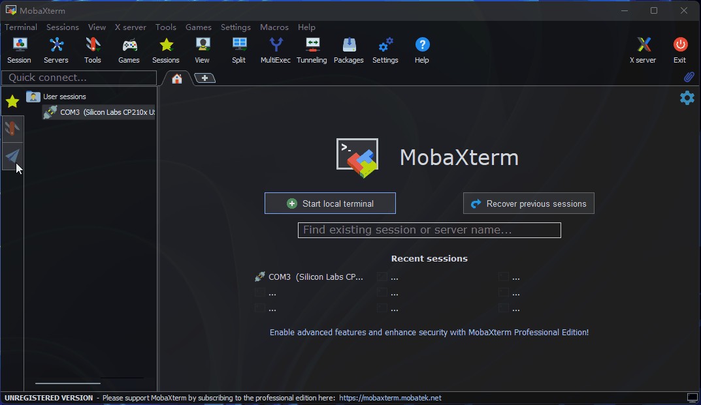
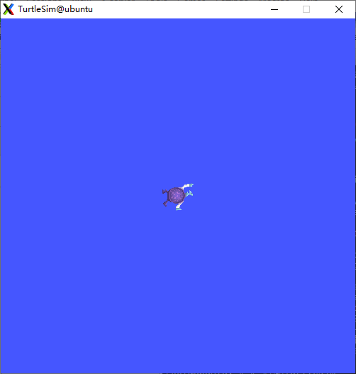

# 初识NodeHub

NodeHub是地平线为机器人爱好者打造的智能机器人应用中心，旨在以更加简单、高效、开放的方式协助机器人爱好者开发自己的智能机器人，具有以下三个主要特性：

- 快速部署，仅需一分钟即可完成Node部署，运行成功率达到100%。

- 轻松拓展，无需复杂编程，通过配置组合不同Node，可实现高阶综合应用。

- 开发分享，所有项目源码托管在github，所有用户可提交分享自己的项目。

在快速入门环节，我们以[《小海龟绘画》](https://developer.horizon.cc/nodehubdetail/173268393141651466)Node为例讲解如何实现某个NodeHub项目的快速部署和体验。

# 体验快速部署

## 文档结构

先来熟悉下NodeHub文档结构，方便我们快速在一个项目中找到需要的内容。NodeHub所有项目文档的一级目录采用同一规范，包含以下6个章节：

- 功能介绍。该章节描述Node实现的主要功能。

- 物料清单。该章节罗列Node中使用到的硬件设备型号和购买连接，方便感兴趣的开发者进行采购。

- 使用方式。该章节对Node的部署和运行方式进行详细的介绍，确保开发者能够根据描述成功运行Node。

- 接口说明。该章节描述Node对外接口，方便开发者串联不同Node。

- 参考资料。该章节用于放置前面章节中技术细节等的补充资料。

- 常见问题。汇总使用该Node经常出现的问题，提高使用效率。

## 了解功能

通过查看“功能介绍”章节可知，该Node主要功能为启动特定的画板，通过键盘控制小乌龟进行绘画。

## 核对物料

通过查看“物料清单”章节可知，该Node在硬件上仅需要具备RDK X3派。

## 部署体验

通过浏览“使用方式”章节可知，在开始部署之前需要确保RDK X3使用的镜像桌面（Desktop）版本以及能够正常访问互联网。RDK X3镜像烧录方式、网络配置方法及IP地址查询可参考[RDK 用户手册](https://developer.horizon.cc/documents_rdk/category/installation)。

如下图所示使用MobaXterm通过ssh连接RDK X3开发板（注意：IP需要替换为自己RDK X3开发板的IP地址）



复制安装“安装first-node功能包”章节下的指令完成《小海龟绘画》Node部署

```shell
sudo apt update
sudo apt install -y tros-first-node
```

在当前MobaXterm终端中复制启动命令，启动《小海龟绘画》Node

```shell
# 设置tros的环境变量
source /opt/tros/setup.bash

# 启动Turtlesim
ros2 run turtlesim turtlesim_node

```
执行命令后MobaXterm会弹出一个包含小海龟的蓝色背景的窗口如下图所示


在MobaXterm中按照之前的方式新打开一个SSH终端，在新的终端中运行启动键盘控制的命令

```shell
# 设置tros的环境变量
source /opt/tros/setup.bash

# 启动OriginBot
 ros2 run turtlesim turtle_teleop_key
```
执行命令后可看到如下日志
```shell
root@ubuntu:~# # 设置tros的环境变量
root@ubuntu:~# source /opt/tros/setup.bash
root@ubuntu:~#
root@ubuntu:~# # 启动OriginBot
root@ubuntu:~#  ros2 run turtlesim turtle_teleop_key

Reading from keyboard
---------------------------
Use arrow keys to move the turtle.
Use G|B|V|C|D|E|R|T keys to rotate to absolute orientations. 'F' to cancel a rotation.
'Q' to quit.
```
在当前终端中根据提示使用键盘“上、下、左、右”按钮控制小海龟移动，使用“G|B|V|C|D|E|R|T”控制小乌龟旋转角度进行绘画。

至此一个Node的部署和运行就完成了。

# 拓展功能

如何将不同功能的Node组合以实现更加高阶的功能呢？

Node之间通常以节点发布/订阅的形式来进行通信，即Node可以向某个节点发布消息实现消息的发送，也可以向某个节点订阅来实现消息的接收。

在《小海龟绘画》Node“接口说明”章节罗列出了该Node发布/订阅消息的情况，这里《小海龟绘画》Node仅有订阅话题名字为/turtle1/cmd_vel，类型为geometry_msgs/msg/Twist，用途是控制小海龟的运动。如果想要控制小海龟移动，可以发布geometry_msgs/msg/Twist类型消息至/turtle1/cmd_vel节点

在进阶教程[《深度学习巡线机器人》](developer.horizon.cc)中，将以具体案例介绍如何实现多个Node的串联。