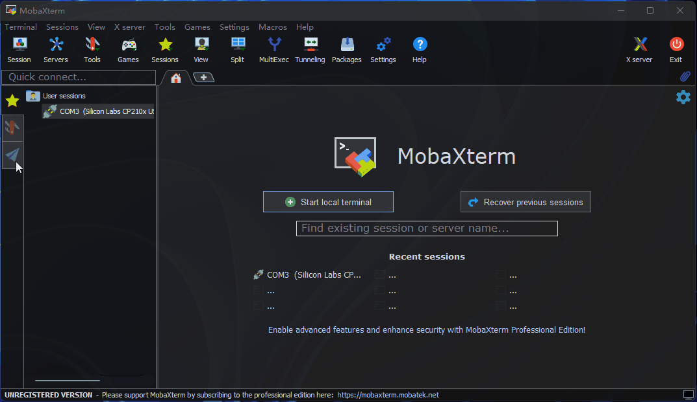
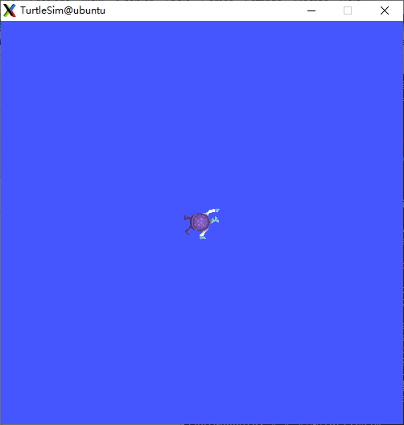

English| [简体中文](./README_cn.md)

# Getting Started with NodeHub

NodeHub is an intelligent robot application center created by Horizon for robot enthusiasts, aiming to assist robot enthusiasts in developing their own intelligent robots in a simpler, more efficient, and open way, with the following three main features:

- Quick Deployment, Node deployment can be completed in just one minute, with a success rate of 100%.

- Easy Expansion, no complex programming required, high-level integrated applications can be achieved by configuring and combining different Nodes.

- Development Sharing, all project source code is hosted on GitHub, and all users can submit and share their projects.

In the quick start section, we take the example of "[Turtle Drawing](https://developer.horizon.cc/nodehubdetail/173268393141651466)" Node to explain how to quickly deploy and experience a NodeHub project.

# Experience Quick Deployment

## Document Structure

Let's first get familiar with the NodeHub document structure, making it easier for us to quickly find the needed content in a project. The primary directory of all NodeHub project documents follows the same specification, containing the following 6 sections:

- Introduction of Functionality. This section describes the main functions implemented by the Node.

- Bill of Materials. This section lists the hardware device models and purchase links used in the Node, facilitating interested developers in purchasing.

- Usage Instructions. This section provides a detailed introduction to the deployment and operation of the Node, ensuring developers can successfully run the Node according to the description.

- Interface Specifications. This section describes the external interfaces of the Node, facilitating developers to connect different Nodes.

- References. This section is used to place supplementary materials such as technical details related to the previous sections.

- FAQs. Summarizing common problems encountered when using this Node to improve efficiency.

## Understanding Functionality

By reviewing the "Introduction of Functionality" section, it is known that the main function of this Node is to start a specific drawing board and control a small turtle for drawing through the keyboard.

## Verifying Materials

By reviewing the "Bill of Materials" section, it is known that this Node only requires an RDK X3 board on the hardware side.

## Deployment Experience

By browsing the "Usage Instructions" section, it is known that before starting the deployment, ensure that the RDK X3 uses the Desktop version of the image and can access the Internet normally. The burning method of RDK X3 image, network configuration, and IP address query can be referred to the [RDK User Manual](https://developer.horizon.cc/documents_rdk/category/installation).

As shown in the image below, connect to the RDK X3 development board via ssh using MobaXterm (Note: Replace the IP with your own RDK X3 development board's IP address)



Copy and install the instructions under the "Install the first-node package" section to complete the deployment of the "Turtle Drawing" Node

```shell
sudo apt update
sudo apt install -y tros-first-node
```

Copy and paste the startup command in the current MobaXterm terminal to launch the Turtle Graphics Node

```shell
# Set up the environment variables for tros
source /opt/tros/setup.bash

# Launch Turtlesim
ros2 run turtlesim turtlesim_node

```
After executing the command, MobaXterm will pop up a window with a blue background containing a turtle as shown in the image below


In MobaXterm, open a new SSH terminal as before and run the command for keyboard control as follows

```shell
# Set up the environment variables for tros
source /opt/tros/setup.bash

# Start OriginBot
ros2 run turtlesim turtle_teleop_key
```
Upon executing the command, you will see the following logs
```shell
root@ubuntu:~# #设置tros的环境变量
root@ubuntu:~# source /opt/tros/setup.bash
root@ubuntu:~#
root@ubuntu:~# #启动OriginBot
root@ubuntu:~#  ros2 run turtlesim turtle_teleop_key

Reading from keyboard
---------------------------
Use arrow keys to move the turtle.
Use G|B|V|C|D|E|R|T keys to rotate to absolute orientations. 'F' to cancel a rotation.
'Q' to quit.
```
In the current terminal, use the "up, down, left, right" keys on your keyboard as prompted to control the movement of the turtle and use "G|B|V|C|D|E|R|T" to control the turtle's rotation angles for drawing.

With that, the deployment and operation of a Node is complete.

# Extension Functions

How can different Nodes be combined to achieve more advanced functions?

Nodes typically communicate with each other through a publish/subscribe mechanism, where a Node can publish messages to another node for message transmission and can also subscribe to messages from another node for message reception.

In the "Interface Specification" section of the "Turtle Graphics" Node, the publishing/subscribing message scenarios are listed. For this Turtle Graphics Node, the only subscription topic is /turtle1/cmd_vel, of type geometry_msgs/msg/Twist, used to control the movement of the turtle. To control the movement of the turtle, you can publish messages of type geometry_msgs/msg/Twist to the /turtle1/cmd_vel node.In the advanced tutorial "[Deep Learning Line-following Robot](developer.horizon.cc)", specific cases will be introduced to demonstrate how to connect multiple nodes in series.
